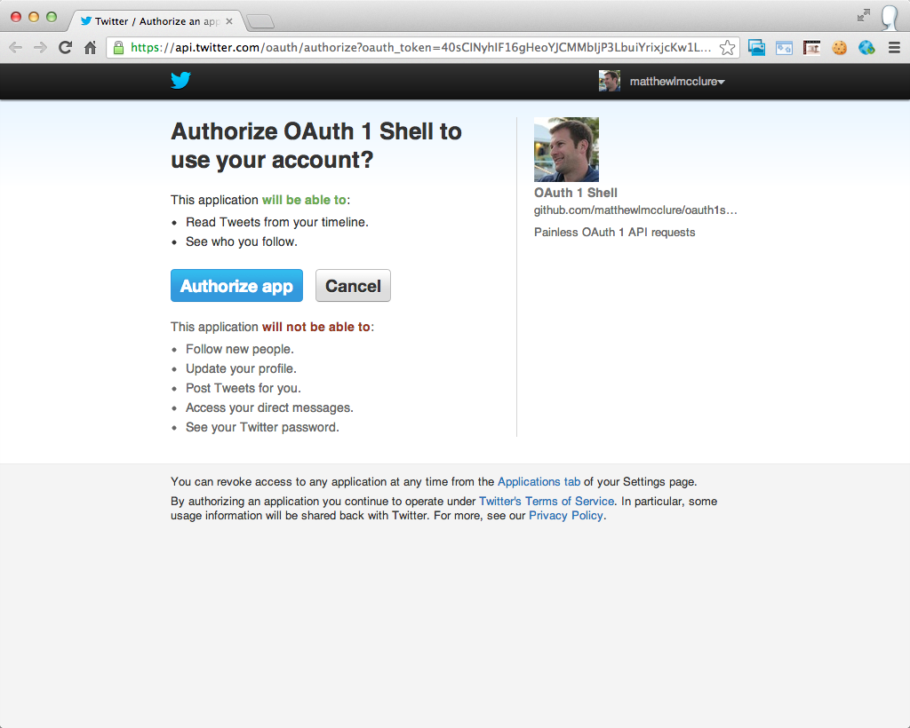

# OAuth 1 Shell

Painless OAuth 1 API requests. An IPython, Requests, oauthlib joint.

## Install

    pip install ipython
    pip install requests
    pip install requests-oauthlib
    git clone https://github.com/matthewlmcclure/oauth1shell.git

## Configure once

    $ cd oauth1shell
    $ cp config.py.template config.py
    $ vi config.py
    ...
    Insert URLs, OAuth parameter transmission method, and client app
    credentials for your favorite API.
    ...

## Get token credentials

    $ ipython -i oauth_1_shell.py
    Python 2.7.3 (default, Sep 15 2012, 19:45:36)
    Type "copyright", "credits" or "license" for more information.

    IPython 0.13.1 -- An enhanced Interactive Python.
    ?         -> Introduction and overview of IPython's features.
    %quickref -> Quick reference.
    help      -> Python's own help system.
    object?   -> Details about 'object', use 'object??' for extra details.

    'config.token_credentials' doesn't look usable.
    Requesting new token credentials.

    ...
    1.0.0.127.in-addr.arpa - - [19/Mar/2013 16:04:10] "GET /?oauth_token=40sCINyhIF16gHeoYJCMMbIjP3LbuiYrixjcKw1Lu1A&oauth_verifier=yO7QZkcvztrwj7aPAygTZzfem860ys49LA31o9FHKkI HTTP/1.1" 200 -
    Display your token_credentials with:
    >>> token_credentials

    Copy token_credentials to config.py to reuse them for future sessions.

    Ready to make requests and display responses like:
    >>> res = requests.get('http://example.com/some/resource', auth=oauth)
    >>> res.json()
    >>> print json.dumps(res.json(), indent=2)

    In [1]:

## Use often

    $ ipython -i oauth_1_shell.py
    Python 2.7.3 (default, Sep 15 2012, 19:45:36)
    Type "copyright", "credits" or "license" for more information.

    IPython 0.13.1 -- An enhanced Interactive Python.
    ?         -> Introduction and overview of IPython's features.
    %quickref -> Quick reference.
    help      -> Python's own help system.
    object?   -> Details about 'object', use 'object??' for extra details.

    Using existing 'config.token_credentials'.

    To request new token credentials, delete token_credentials from
    config.py and re-run.

    Display your token_credentials with:
    >>> token_credentials

    Copy token_credentials to config.py to reuse them for future sessions.

    Ready to make requests and display responses like:
    >>> res = requests.get('http://example.com/some/resource', auth=oauth)
    >>> res.json()
    >>> print json.dumps(res.json(), indent=2)

    In [1]: res = requests.get('https://api.twitter.com/1.1/users/show.json?screen_name=kennethreitz', auth=oauth)

    In [2]: res.json()
    Out[2]:
    {u'contributors_enabled': False,
     u'created_at': u'Wed Jun 24 23:28:06 +0000 2009',
     u'default_profile': False,
     u'default_profile_image': False,
     u'description': u'Wandering street photographer and moral fallibilist. Simplicity is always better than functionality.\r\n\r\nPython Overlord for Heroku. ',
     u'entities': {u'description': {u'urls': []},
      u'url': {u'urls': [{u'display_url': u'kennethreitz.org',
         u'expanded_url': u'http://kennethreitz.org/',
         u'indices': [0, 20],
         u'url': u'http://t.co/iBG2asC4'}]}},
     u'favourites_count': 12844,
     u'follow_request_sent': False,
     u'followers_count': 4932,
     u'following': True,
     u'friends_count': 613,
     u'geo_enabled': True,
     u'id': 50478950,
     u'id_str': u'50478950',
     u'is_translator': False,
     u'lang': u'en',
     u'listed_count': 312,
     u'location': u'Shenandoah Valley',
     u'name': u'Kenneth Reitz',
     u'notifications': False,
     u'profile_background_color': u'022330',
     u'profile_background_image_url': u'http://a0.twimg.com/images/themes/theme15/bg.png',
     u'profile_background_image_url_https': u'https://si0.twimg.com/images/themes/theme15/bg.png',
     u'profile_background_tile': False,
     u'profile_banner_url': u'https://si0.twimg.com/profile_banners/50478950/1358770697',
     u'profile_image_url': u'http://a0.twimg.com/profile_images/3142394277/31cf131d7acbc4332b43e3a95fc91dec_normal.png',
     u'profile_image_url_https': u'https://si0.twimg.com/profile_images/3142394277/31cf131d7acbc4332b43e3a95fc91dec_normal.png',
     u'profile_link_color': u'0084B4',
     u'profile_sidebar_border_color': u'A8C7F7',
     u'profile_sidebar_fill_color': u'C0DFEC',
     u'profile_text_color': u'333333',
     u'profile_use_background_image': True,
     u'protected': False,
     u'screen_name': u'kennethreitz',
     u'status': {u'contributors': None,
      u'coordinates': None,
      u'created_at': u'Tue Mar 19 12:37:27 +0000 2013',
      u'entities': {u'hashtags': [],
       u'urls': [],
       u'user_mentions': [{u'id': 19177286,
         u'id_str': u'19177286',
         u'indices': [0, 8],
         u'name': u'J\xe9r\xf4me',
         u'screen_name': u'phollow'}]},
      u'favorite_count': 0,
      u'favorited': False,
      u'geo': None,
      u'id': 313992615026638848,
      u'id_str': u'313992615026638848',
      u'in_reply_to_screen_name': u'phollow',
      u'in_reply_to_status_id': 313991421294170112,
      u'in_reply_to_status_id_str': u'313991421294170112',
      u'in_reply_to_user_id': 19177286,
      u'in_reply_to_user_id_str': u'19177286',
      u'lang': u'en',
      u'place': None,
      u'retweet_count': 0,
      u'retweeted': False,
      u'source': u'<a href="http://tapbots.com/software/tweetbot/mac" rel="nofollow">Tweetbot for Mac</a>',
      u'text': u'@phollow indeed! And it\u2019s so small!',
      u'truncated': False},
     u'statuses_count': 34321,
     u'time_zone': u'Eastern Time (US & Canada)',
     u'url': u'http://t.co/iBG2asC4',
     u'utc_offset': -18000,
     u'verified': False}

    In [3]:
